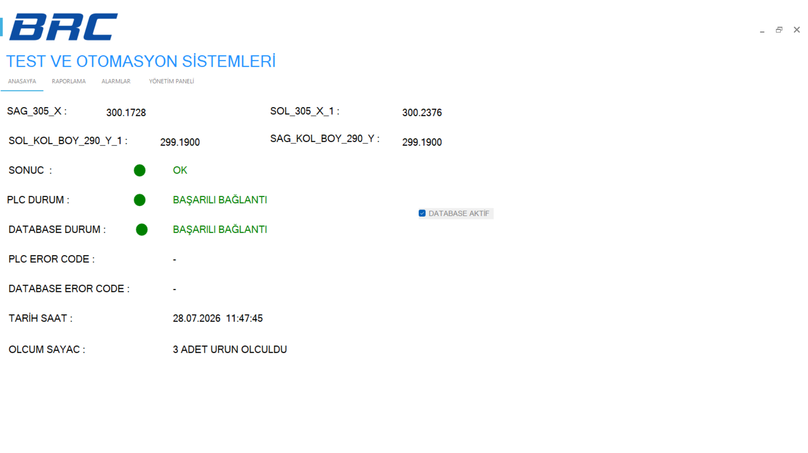
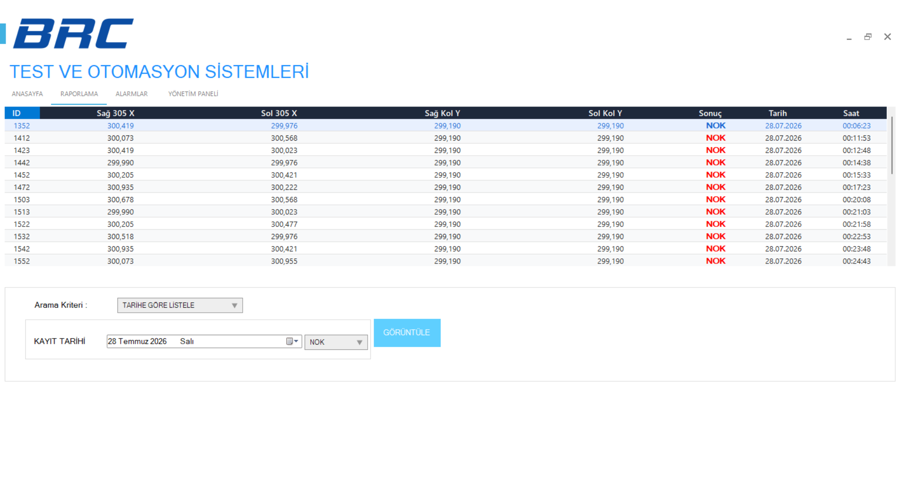
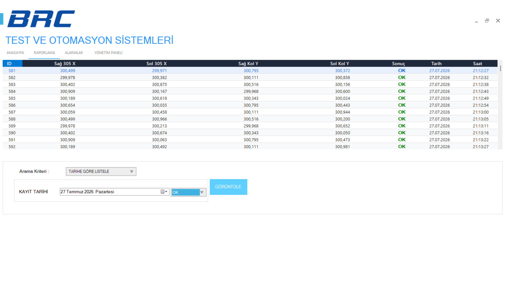
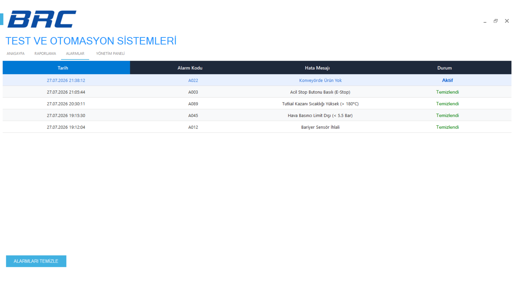

# PLC Sheet Metal Measurement (SMM) & Barcode SCADA

🌐 [English](#english-version) | 🇹🇷 [Türkçe Versiyon](#türkçe-versiyon)

---

## English Version

This project is an industrial **SCADA and Data Logger software** developed to interface with **Siemens S7-1200 PLCs** to read high-precision washing machine top table SMM measurements, log data to **Microsoft SQL Server**, and generate **TSPL-based QR codes/barcodes** for industrial thermal printing.

This system is deployed and active in production lines of home appliance manufacturers (such as Farel & Balorman) to ensure 100% automated measurement tracking and quality control.

### 🚀 Key Features
*   **PLC Handshake Integration:** Implements a robust rising-edge handshake protocol with Siemens S7-1200 PLCs (via S7.Net) to prevent duplicate reads and ensure synced cycles.
*   **SQL Server Logging & Reports:** Logs measurements (Right, Left, Lengths), cycle times, environmental temperature/humidity, and results (OK/NOK) dynamically into MS SQL Server.
*   **Argox/TSC TSPL Label Generator:** Generates custom TSPL (Taiwan Semiconductor Printing Language) strings embedding production data and QR codes, ready to be sent to Argox/TSC thermal printers.
*   **Modern SCADA Grid:** Featuring a customized, non-flickering DataGridView styled with dark themes, alternate zebra rows, and color-coded status cells (Green for OK, Bold Red for NOK).
*   **Alarm Monitoring:** Includes a dedicated alarm tab populated dynamically from the database to log and trace system-level warnings and errors.
*   **Configurable Setup:** Connection strings, PLC IP addresses, and active features (such as database logging or specific measurement channels) are fully customizable via `config.txt`.

### 💻 Technologies Used
*   **Language & Framework:** C# (.NET Framework 4.7.2 WinForms)
*   **Communication Engine:** S7.Net (PLC Connection)
*   **Database:** Microsoft SQL Server (Client: SqlClient)
*   **UI Controls:** MetroSet UI (Modern Flat Theme)

### 📂 Directory Structure
*   `SQL_AKTAR V2.0/` - Main C# SCADA application source code.
*   `Publish/` - Pre-compiled executable binaries along with libraries and default configuration.
*   `database_setup.sql` - Database schema script to easily create the tables.

### 🚀 Getting Started
1. Open `SQL_AKTAR V2.0.sln` in Visual Studio.
2. Restore NuGet packages.
3. Set up the SQL Server database using `database_setup.sql`.
4. Configure connection parameters in `config.txt` inside the `Publish/` directory.
5. Build and run the project.

### 📸 Screenshots
| Main Dashboard (Anasayfa) | Production Reporting (Raporlama) |
|---|---|
|  |  |
| **Alternative Report View** | **Alarms Log (Alarmlar)** |
|  |  |

---

## Türkçe Versiyon

Bu proje; **Siemens S7-1200 PLC** otomasyon sistemlerinden yüksek hassasiyetli çamaşır makinesi üst tabla SMM ölçüm verilerini çekmek, bu verileri **Microsoft SQL Server** veritabanına kaydetmek ve endüstriyel termal yazıcılar için **TSPL tabanlı QR kod / barkod** etiketleri üretmek amacıyla geliştirilmiş endüstriyel bir **SCADA ve Veri Kayıt (Data Logger) yazılımıdır.**

Sistem, beyaz eşya yan sanayi üreticilerinde (Farel ve Balorman) çamaşır makinesi üst tabla hatlarında aktif olarak kullanılmaktadır.

### 🚀 Önemli Özellikler
*   **PLC El Sıkışma (Handshake):** S7.Net kütüphanesi kullanılarak S7-1200 PLC ile kararlı bir yükselen kenar el sıkışma algoritması uygulanmıştır. Çift kaydı engeller.
*   **SQL Veritabanı ve Raporlama:** Sağ-sol ölçümler, kol boyları, ortam sıcaklığı/nemi ve test sonucunu (OK/NOK) otomatik olarak MS SQL Server'a kaydeder.
*   **Argox/TSC TSPL Etiket Üreteci:** Üretim tarihi ve ölçüm verilerini içeren QR kodları otomatik üretip TSPL formatında barkod yazıcısına gönderir.
*   **Modern SCADA Tablosu:** Özel renklendirilmiş (OK için Yeşil, NOK için Kalın Kırmızı), zebra satırlı ve koyu başlık tasarımlı hızlı DataGridView hücresi yapısı.
*   **Alarm Takip Ekranı:** Veritabanından dinamik beslenen, sistem arıza ve arıza geçmişini gösteren modern alarm tablosu.
*   **Dinamik Konfigürasyon:** PLC IP adresi, port, veritabanı aktiflik durumları kod değiştirmeden `config.txt` üzerinden ayarlanabilir.

### 💻 Kullanılan Teknolojiler
*   **Dil ve Framework:** C# (.NET Framework 4.7.2 WinForms)
*   **Haberleşme Kütüphanesi:** S7.Net (Siemens PLC Haberleşmesi)
*   **Veritabanı:** Microsoft SQL Server
*   **Arayüz Tasarımı:** MetroSet UI

### 📂 Dizin Yapısı
*   `SQL_AKTAR V2.0/` - Ana C# SCADA uygulaması kaynak kodları.
*   `Publish/` - Derlenmiş ve kuruluma hazır uygulama exe/dll dosyaları ile varsayılan ayar dosyası.
*   `database_setup.sql` - Veritabanı tablolarını ve sahte alarm verilerini oluşturan SQL betiği.

### 🚀 Başlangıç
1. Visual Studio ile `SQL_AKTAR V2.0.sln` çözüm dosyasını açın.
2. NuGet paketlerini geri yükleyin.
3. `database_setup.sql` dosyasını SQL Server üzerinde çalıştırarak veritabanını kurun.
4. `Publish/` klasörü içindeki `config.txt` dosyasını kendi PLC IP ve SQL bağlantı bilginize göre düzenleyin.
5. Projeyi derleyin ve çalıştırın.

### 📸 Ekran Görüntüleri
| Ana Gösterge Paneli (Anasayfa) | Üretim Raporlama Paneli (Raporlama) |
|---|---|
|  |  |
| **Alternatif Rapor Görünümü** | **Sistem Hata Günlüğü (Alarmlar)** |
|  |  |
